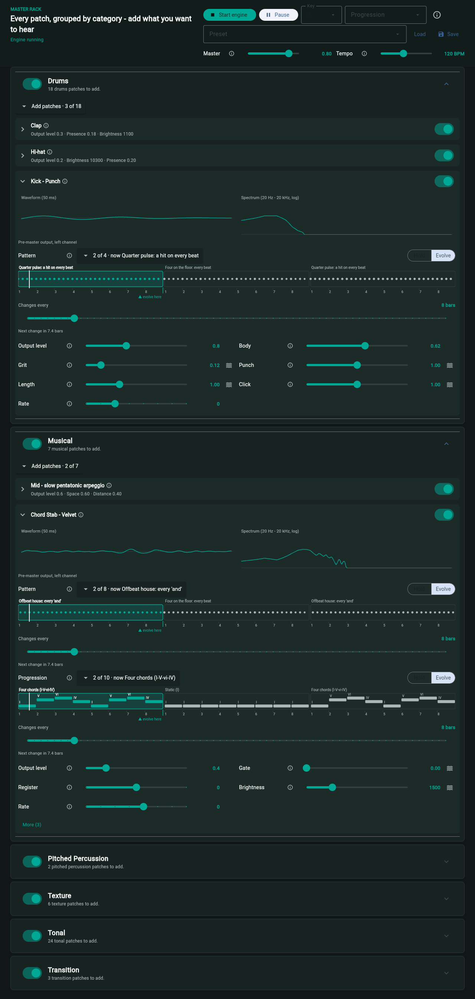

# Pyoscillate

Agentic DSP patches for Pyo, played live as a modular synthesizer through a Flet GUI.



*The master rack with drum and musical patches on. Open patches show a live waveform and spectrum, and Evolve is cycling patterns and chord progressions.*

Pyoscillate is built for **agentic music development from DSP fundamentals**. An AI agent doesn't pick presets or trigger samples. It reasons from musical intent down to oscillators, envelopes, filters and delay lines, then writes the Pyo patches, wires them into a rack on a shared clock, and checks the result by measuring rendered audio. You play and tune the rack live from a Flet app.

## How it works

- **Patches:** each `Patch` is a small module with its own sound and `Param`s (volume included), which are the only handles to its settings.
- **Shared timing:** one clock and tempo keep every voice locked together.
- **Racks:** a project's `Rack` holds patches as typed `Slot`s, grouped by nestable `GroupController`s (`src/pyoscillate/projects/{project}/rack.py`). Nothing is looked up by string name.
- **GUI:** `src/flet/base.py` renders each patch as a panel with an enable switch, sliders and a volume control, all driving one rack, clock and audio engine.
- **Presets:** saved as JSON from the GUI into each app's `presets/` folder (created on demand, none committed).

## From one prompt to a playable rack

You type one sentence: **"Create a new project for a classic techno sound"**. Instruction files route it, step by step:

```
Your prompt
   │
   ▼
AGENTS.md ─────────── "A new project? Follow the new-project workflow."
   │
   ▼
music-theory skill ── What is classic techno?  (tempo, kick pattern, harmony, form)
   │
   ▼
pyo-music skill ───── What should it sound like, and what DSP makes that sound?
   │
   ▼
projects/AGENTS.md ── Write the plan (README) first, then reuse or build patches, then wire the rack
   │
   ▼
patches/AGENTS.md ─── How every patch must be built
   │
   ▼
Playable rack in the Flet app
```

| Step | File | Job |
| --- | --- | --- |
| Route | [AGENTS.md](AGENTS.md) | Picks the path and forbids jumping from a word ("dark") straight to a Pyo object |
| Musical meaning | [music-theory skill](.claude/skills/music-theory/SKILL.md) | Turns "classic techno" into tempo, rhythm, harmony and structure |
| Sonic meaning | [pyo-music skill](.claude/skills/pyo-music/SKILL.md) | Turns the musical brief into sound behaviour and DSP building blocks |
| Plan and build | [projects/AGENTS.md](src/pyoscillate/projects/AGENTS.md) | README first, reuse existing patches, then wire the rack |
| Patch rules | [patches/AGENTS.md](src/pyoscillate/patches/AGENTS.md) | The contract every patch follows, plus a per-family file (for example [kick](src/pyoscillate/patches/drums/kick/AGENTS.md)) |

### Responding to feedback

Say "the kick is too boomy" and the agent goes back through the same chain. It translates the word into something measurable with [timbre-descriptors.md](.claude/skills/pyo-music/references/timbre-descriptors.md), renders the patch offline to measure it ([tests/AGENTS.md](tests/AGENTS.md)), changes one thing, and measures again. Settings are `Param`s, so you can also tweak them live in the GUI and save a preset.

## Installation

### macOS dependencies

Install the required system libraries with Homebrew:

```bash
brew update
brew install flac ffmpeg liblo libsndfile portaudio portmidi
```

If you need to refresh an existing install, a common follow-up is:

```bash
brew reinstall flac
```

### uv setup

This project is intended to work cleanly with `uv`.

```bash
curl -LsSf https://astral.sh/uv/install.sh | sh
uv sync --group dev
```

If you prefer a local environment explicitly:

```bash
uv venv
source .venv/bin/activate
uv pip install -e .
```

## Run the master rack

The master rack (`src/flet/master_rack/app.py`) is the main app. From the project root:

```bash
uv run master-rack
```

This opens a desktop window and writes a timestamped crash log to `logs/` (last 20 kept). Add `--debug` for verbose logging, or `--log-dir PATH` to change where logs go. A log without a "clean shutdown" line means a hard crash.

To run it in a browser instead:

```bash
uv run flet run --web --port 8561 src/flet/master_rack/app.py
```

Then open http://127.0.0.1:8561. If the port is taken, pick another; a stale app can keep answering on it.

In the app:

1. Click **Start engine**. Each page load starts stopped, with no patches added.
2. Expand a group and use **Add patches**, then flip a patch's switch on.
3. Expand a patch for its waveform, spectrum and sliders. Set a pattern or chord progression to **Evolve** to cycle through the ticked options every N bars.

Other racks live under `src/flet/` (`deep_house`, `forest_psytrance`, `lofi`, `slowed_reverb`, `psyambient`); run them with `uv run flet run src/flet/<rack>/app.py`.

## Build a standalone app

```bash
uv run python scripts/build_exe.py master_rack
```

The executable lands in `dist/`. The Release GitHub Action does the same and attaches the macOS dmg and Windows exe to a release.

## Typical workflow

A typical session looks like this:

1. launch the master rack and start the audio engine
2. set the shared tempo and switch voices on
3. shape each voice with its sliders while the rack plays
4. save useful combinations as presets
5. edit patch modules or the rack definition, then relaunch

## Debugging patches

Play any single patch module on its own with `uv run flet run src/flet/patch/app.py -- <module> [param=value ...]`, or render and measure one offline with `uv run python -m pyoscillate.analysis <module> --set name=value`. Both build the patch with a full `BuildContext` (tempo, clock, harmony), so a failing lifecycle stage shows up in isolation.

## License

Released under the [MIT License](LICENSE). Pyoscillate depends on [Pyo](https://github.com/belangeo/pyo), which is LGPL-3.0; if you bundle Pyo in a distributed build, include its licence notice.

Under active development: a creative coding environment for Pyo, DSP and live modular sound design.
